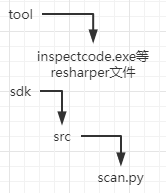

## 当前版本
resharper当前版本：2022.1.2

## 环境介绍
> 工具执行需要项目中包含`sln`文件

> 本工具需要依赖本地windows构建机.net环境，使用之前请配好项目所依赖指定版本的所有环境

> 依赖环境可以使用vs studio打开解决方案，如果系统缺少项目的依赖环境会提示安装，安装完即可

> windows中还需要配置python3环境
> 
> 需要使用python3、python命令

## 目录介绍
sdk python执行脚本解析目录

tool 工具二进制命令目录

目录结构

  

## 入参文件(json)
> projName 项目名称
> 
> scanPath 扫描路径，此处需使用绝对路径
> 
> openCheckers 检查的规则集

openCheckers 子属性：
> checkerName 规则名称
> 
> severity 告警级别
> 
> checkerOptions 携带的参数

## 使用
[ci-CodeCCCheckAtom](https://github.com/TencentBlueKing/ci-CodeCCCheckAtom)
codecc插件也需要更新

如果需要修改resharper的配置信息：
- resource目录下的`config.properties`文件第23行可修改工具存放位置，其他resharper请勿更改
- sdk\src\scan.py 脚本种的windToolPath常量也需要修改，因为是用的绝对路径写死的
- ci-CodeCCCheckAtom  CodeccUtils.kt 的getResharperScanPy()方法需要修改下载路径
- 默认保存路径：`C:\\data\\codecc_software\\resharper_scan`

## 常见问题
> A：resharper老是输出一些没用的告警
> 
> B：这可能是你的构建机上没有你扫描项目所需要的环境配置

## 输出结构例子
> {\
      "filePath": "xxx.cs",\
      "line": "8",\
      "checkerName": "FieldCanBeMadeReadOnly.Global",\
      "description": "Field can be made readonly"\
    },\
    {\
      "filePath": "xxx.cs",\
      "line": "16",\
      "checkerName": "PossibleNullReferenceException",\
      "description": "Possible 'System.NullReferenceException'"\
    },\
    {\
      "filePath": "xxx.cs",\
      "line": "20",\
      "checkerName": "BaseObjectGetHashCodeCallInGetHashCode",\
      "description": "Overridden 'GetHashCode()' calls base 'Object.GetHashCode()'"\
    }

